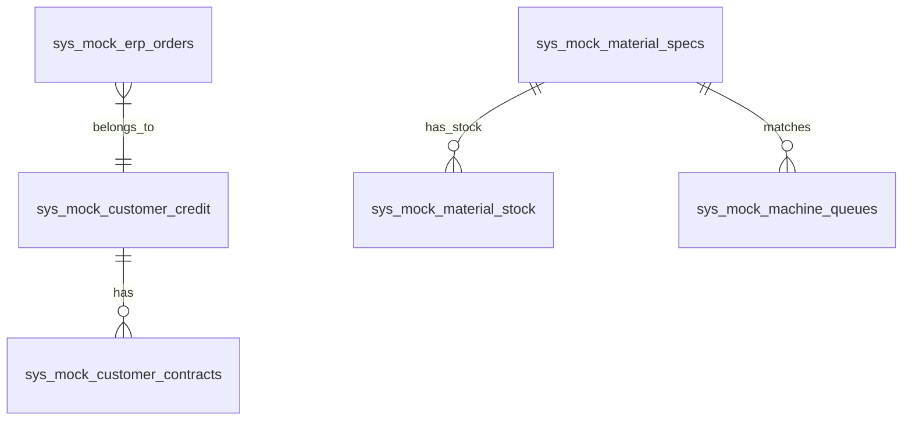
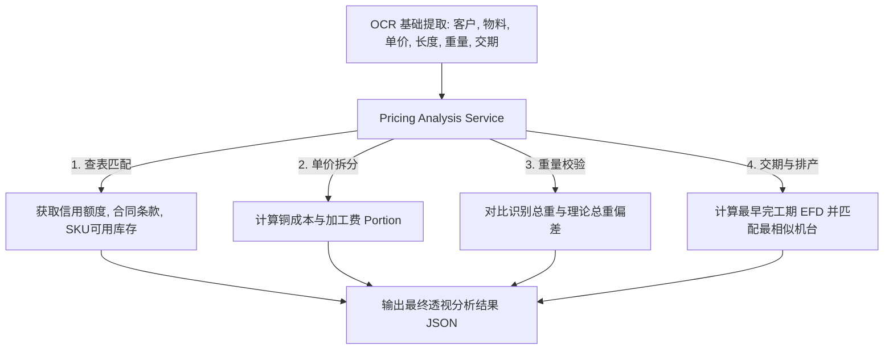

# 物料智能报价系统优化方案（精细化代码解读与虚拟数据构建方案）

针对物料智能报价系统优化需求（序号 3 ~ 9），本文档在**深入阅读与解读现有前后端代码**的基础上，明确已实现与缺失的功能边界，并针对“许多数据在 PostgreSQL 中缺失”这一痛点，提出**完整的虚拟数据表结构设计与 Seeding 方案**，从而构建一套闭环运行、数据互联的智能报价中枢。

---

## 1. 当前代码精细化解读 (Implemented vs. Missing)

通过深入阅读 `MaterialQuoteModule.tsx` (前端) 与 `server.js` (后端)，我们梳理出如下功能状态对比表：

### 1.1 前端代码状态 (`MaterialQuoteModule.tsx`)
* **已实现功能**：
  * **三栏布局流体框架**：左侧文件上传/预览/配置（24%）、中间 AI 识别流水线展示（56%）、右侧历史询价单列表（20%）。
  * **大模型流式 SSE 渲染**：利用 `abortRef` 与 `TextDecoder` 实时接收后端 SSE 转发，并在分析结束后自动保存到数据库历史，触发 `app-task-done` 状态。
  * **多方案动态匹配 UI**：`parseAIResult` 模块负责从文本回包中提取 JSON，在卡片中提供 `match_1`, `match_2`, `match_3` 方案切换按钮，支持切换匹配项后自动联动显示对应的采购记录、波动趋势和最终建议。
  * **资质与脱敏支持**：集成了 `maskCustomerName` 前端脱敏组件。
* **缺失功能 (待构建)**：
  * **OCR 基础参数不足 (R1/R5/R7)**：当前仅提取了 `customer_name`, `material_no`, `material_recognize`, `unit_price`。**缺少了“订货长度”、“标称重量（重量）”、“要求交期”的识别与呈现**。
  * **客户画像卡片 (R3)**：未实现集成获取信用额度、当前欠款、发货频次与匹配成品库存的独立展示抽屉或子组件。
  * **单价分拆可视化 (R4)**：缺少铜价 Portion（蓝色）与加工费 Portion（橙色）的百分比柱状进度条与合理性判定文案。
  * **重量偏差分析 (R5)**：缺少对比“识别总重” vs “理论总重”的偏差率展示区。
  * **交期评估图谱 (R7)**：缺少分析“要求交期” vs “理论完工期”的交付红绿灯时序图。
  * **排产机台卡片 (R9)**：缺少“智能机台推荐”与“排产顺序插单推荐”的打分展示小卡。
  * **ERP 提交闭环 (R8)**：界面顶部的【生成单据】按钮绑定为空函数 `onClick={() => {}}`，无法实现提交审核和同步 ERP。

### 1.2 后端代码状态 (`server.js` Lines 4018-4225)
* **已实现功能**：
  * **文件上传路由 (`/api/material-quote/upload`)**：支持 multer 处理附件并保存至本地静态目录 `/uploads/material-quote`。
  * **流式转发路由 (`/api/material-quote/run`)**：封装 Bearer Token 并转发至 Dify `/v1/chat-messages` 服务，以 SSE 方式块流（chunk）回写给前端。
  * **历史读写路由 (`/api/material-quote/history`)**：支持在 `sys_material_quotes` 表中增删改查当前用户的最近 50 条询价记录。
* **缺失功能与核心痛点 (待构建)**：
  * **数据库表完全空置**：当前 PostgreSQL (数据库 `dify_memory`) 中完全没有客户信用评级表、特批合同定价条款表、实时成品物料库存表、规格单位重量字典、加工费定额字典、排产队列与机台状态表。
  * **核算服务组件缺失**：未提供加工费分拆、重量比对、交期 RCCP 分析及机台相似度匹配打分的后台核算类。
  * **ERP 写入路由缺失**：缺少接收确认参数并写入 mock ERP 正式库表的接口。

---

## 2. 拟构建的虚拟数据库表结构设计 (PostgreSQL)

为解决 pgsql 中无相关数据的问题，我们需要在 `dify_memory` 库中一次性建起 6 张虚拟业务表，并填充合理的业务 Mock 数据（Seed Data）。



### 2.1 客户风控信用表 (`sys_mock_customer_credit`)
保存模拟客户的基本风控信用资质、账期与应收账款总额。
```sql
CREATE TABLE IF NOT EXISTS sys_mock_customer_credit (
    id                  SERIAL PRIMARY KEY,
    customer_name       VARCHAR(100) NOT NULL UNIQUE,       -- 客户名称
    credit_limit        NUMERIC(12,2) NOT NULL DEFAULT 0.00,-- 信用额度 (元)
    outstanding_balance NUMERIC(12,2) NOT NULL DEFAULT 0.00,-- 拖欠/应收金额 (元)
    overdue_amount      NUMERIC(12,2) NOT NULL DEFAULT 0.00,-- 超期拖欠金额 (元)
    credit_status       VARCHAR(20) NOT NULL DEFAULT '良好',  -- 良好 / 预警 / 严重超期
    risk_level          VARCHAR(10) NOT NULL DEFAULT 'B'    -- 客户风险评级 A / B / C / D
);
```

### 2.2 客户合同定价条款表 (`sys_mock_customer_contracts`)
定义每个客户签订的特殊定价模式（现货价、点铜结算、月度均价）及约定的加价系数。
```sql
CREATE TABLE IF NOT EXISTS sys_mock_customer_contracts (
    id                  SERIAL PRIMARY KEY,
    customer_name       VARCHAR(100) NOT NULL,
    contract_no         VARCHAR(50) NOT NULL UNIQUE,        -- 合同编号
    copper_price_type   VARCHAR(20) NOT NULL,               -- 现货价 / 点铜 / 月均价
    base_processing_fee NUMERIC(10,2) NOT NULL,             -- 合同特批基础加工费/米
    markup_ratio        NUMERIC(4,2) NOT NULL DEFAULT 1.00, -- 合同额外加价系数 (1.00 - 1.20)
    valid_until         TIMESTAMP NOT NULL                  -- 有效截止时间
);
```

### 2.3 物料规格与重量加工费定额表 (`sys_mock_material_specs`)
这是**最核心的工艺参数表**。将型号规格转化为具体的材料重量（铜重/公里）与标准加工费，用作理论算费及重量合理性校核。
```sql
CREATE TABLE IF NOT EXISTS sys_mock_material_specs (
    material_no         VARCHAR(50) PRIMARY KEY,            -- 匹配物料号 (e.g. Mat-YJV4x25)
    model_name          VARCHAR(50) NOT NULL,               -- 规格名称 (e.g. YJV-4*25)
    copper_weight_km    NUMERIC(8,3) NOT NULL,              -- 每千米理论铜重 (吨/km，或kg/m)
    insulation_weight_km NUMERIC(8,3) NOT NULL,             -- 每千米理论绝缘护套重 (吨/km)
    standard_unit_weight NUMERIC(8,3) NOT NULL,             -- 每米理论总重量 (kg/m)
    standard_processing_fee NUMERIC(10,2) NOT NULL          -- ERP标准定额加工费/米 (元/m)
);
```

### 2.4 物料实物库存表 (`sys_mock_material_stock`)
模拟工厂各成品备货库的物理库存。
```sql
CREATE TABLE IF NOT EXISTS sys_mock_material_stock (
    id                  SERIAL PRIMARY KEY,
    material_no         VARCHAR(50) NOT NULL,
    warehouse_name      VARCHAR(50) NOT NULL,               -- 1号成品库 / 2号周转库
    qty_on_hand         NUMERIC(10,2) NOT NULL DEFAULT 0,   -- 实物库存量 (米)
    qty_allocated        NUMERIC(10,2) NOT NULL DEFAULT 0    -- 锁库/占用库存量 (米)
);
```

### 2.5 机台与生产排程等待队列表 (`sys_mock_machine_queues`)
用于“机台推荐”与“最佳生产顺序”相似度估算。
```sql
CREATE TABLE IF NOT EXISTS sys_mock_machine_queues (
    id                  SERIAL PRIMARY KEY,
    machine_id          VARCHAR(20) NOT NULL UNIQUE,        -- 设备ID (e.g. Ext-03)
    machine_name        VARCHAR(50) NOT NULL,               -- 设备名称 (e.g. 挤塑3号线)
    capable_specs       TEXT NOT NULL,                      -- 适用加工截面规格范围 (逗号隔开)
    current_load_percent INT NOT NULL DEFAULT 50,           -- 产能负荷占比 (50% - 100%)
    queue_duration_hours NUMERIC(6,2) NOT NULL DEFAULT 0.00,-- 当前排队排产等待时长 (小时)
    last_produced_spec  VARCHAR(50),                        -- 上一个正在/刚完成的规格
    standard_lead_time_km NUMERIC(4,1) NOT NULL DEFAULT 1.0 -- 每公里标准加工时长 (小时/km)
);
```

### 2.6 模拟 ERP 正式内部订单表 (`sys_mock_erp_orders`)
接收前端“一键推送到 ERP”的成交单据。
```sql
CREATE TABLE IF NOT EXISTS sys_mock_erp_orders (
    id                  VARCHAR(50) PRIMARY KEY,            -- 订单编号 (SO-YyyyMMddxxx)
    customer_name       VARCHAR(100) NOT NULL,
    material_no         VARCHAR(50) NOT NULL,
    qty                 NUMERIC(10,2) NOT NULL,             -- 订货量 (米)
    unit_price          NUMERIC(10,2) NOT NULL,             -- 成交单价 (元/m)
    total_amount        NUMERIC(12,2) NOT NULL,             -- 合计金额
    delivery_date       DATE NOT NULL,                      -- 交期
    copper_price_type   VARCHAR(20) NOT NULL,               -- 铜价结算类型
    copper_base_price   NUMERIC(10,2) NOT NULL,             -- 基准铜价
    machine_assigned    VARCHAR(50),                        -- 推荐机台
    created_at          TIMESTAMP DEFAULT CURRENT_TIMESTAMP
);
```

---

## 3. 后端核算引擎设计 (Services Algorithms)

后端需构建一个报价核算中枢 `services/pricingAnalysisService.js`，该模块将 OCR 结构化提取的数据与上述 6 张虚拟表关联，执行四大算法逻辑：



### 3.1 单价分拆与价格合理性算法 (R4)
1. 传入物料号，在 `sys_mock_material_specs` 中查出理论铜重 `copper_weight_km` ($t/km = kg/m$)。
2. 计算**今日单件铜成本**：
   $$\text{CopperCost} = \text{copper\_weight\_km} \times \text{今日长江现货铜价(元/kg)}$$
   *(今日铜价支持外部 API 实时拉取，或采用后台随机轻微波动机制，如 73,400 元/吨)*
3. 算出**推导出的加工费 Portion**：
   $$\text{DerivedProcessingFee} = \text{UnitPrice} - \text{CopperCost}$$
4. 与 ERP 标准加工费定额对比：
   * **价格偏低预警 (🔴)**：若 $\text{DerivedProcessingFee} < \text{standard\_processing\_fee} \times 0.90$。
   * **价格合理 (🟢)**：若处于合理公差 $[90\%, 130\%]$。
   * **价格溢价 (🟡)**：若 $\text{DerivedProcessingFee} > \text{standard\_processing\_fee} \times 1.30$。

### 3.2 重量偏差率校验算法 (R5)
$$\text{TheoreticalWeight} = \text{standard\_unit\_weight (kg/m)} \times \text{OrderLength (m)}$$
$$\text{DeviationRate} = \frac{|\text{ExtractedWeight} - \text{TheoreticalWeight}|}{\text{TheoreticalWeight}} \times 100\%$$
* **若 $\text{DeviationRate} > 5\%$**，返回判定结果：`🔴 重量异常，偏离理论值过大，请复核规格型号或长度单位`。

### 3.3 交期粗能力 (RCCP) 算法 (R7)
1. 查出该机台的积压排队时长 `queue_duration_hours` 与每公里生产速率 `standard_lead_time_km`。
2. 测算生产周期（小时）：
   $$\text{ProductionHours} = \text{queue\_duration\_hours} + \frac{\text{OrderLength(m)}}{1000} \times \text{standard\_lead\_time\_km}$$
3. 测算**理论最早完工日期 (EFD)**：
   $$\text{EFD} = \text{今日日期} + \lceil \text{ProductionHours} / 8\text{小时(按单班工作制)} \rceil \text{天} + 1\text{天(物料齐套缓冲)}$$
4. 对标客户要求交期 `RequestedDeliveryDate`：
  * 若 $\text{RequestedDeliveryDate} \ge \text{EFD}$，返回 🟢 交期合理。
  * 若 $\text{EFD} - 2 \le \text{RequestedDeliveryDate} < \text{EFD}$，返回 🟡 交期紧张。
  * 若 $\text{RequestedDeliveryDate} < \text{EFD} - 2$，返回 🔴 交期严重不足。

### 3.4 智能机台推荐与排序插单算法 (R9)
1. 获取物料规格的截面参数，在 `capable_specs` 中做模糊搜索，过滤出有物理加工能力的机台列表。
2. 对符合能力的各机台，按照以下因子进行推荐打分：
   $$\text{Score} = (100 - \text{current\_load\_percent}) + \text{SimilarityBonus}$$
   * **$\text{SimilarityBonus}$（换产调试加分）**：若机台 `last_produced_spec` 与当前订单物料规格前缀完全一致（说明为同系列线材，无需换模），奖励 30 分；若截面积一致（无需调节拉丝模），奖励 15 分。
3. 推荐得分最高的机台，并输出排产顺序插单方案。

---

## 4. 前端交互演进设计 (UI Prototype Design)

为在 `MaterialQuoteModule.tsx` 中完美渲染这套高保真数据联动，我们将对界面元素做如下针对性升级：

```
三栏式布局主控制台结构
+------------------------------------------------------------------------------------------------------+
| [Header] 物料智能报价系统 Pro (WebOS)  |  登录账号: admin  | 长江现货铜价: 73,400 元/吨 (🟢 +0.8%)       |
+------------------------------------------------------------------------------------------------------+
| 【左侧：文件上传与识别控制栏】  | 【中间：AI 核心分析流水线】                  | 【右侧：360° 客户风控与库存】|
|                                |                                              |                              |
| +----------------------------+ | +-- [深圳市腾讯计算机系统有限公司 🛡️已脱敏] -+ | +-- [风控与账期评定] -------+ |
| |   拖拽上传询价单           | | | 共识别 1 项物料                            | | | 信用等级: 🛡️ AA         | |
| | [PDF / PO图片已上传]        | | +------------------------------------------+ | | 信用额度: ¥2,000,000      | |
| +----------------------------+ |                                              | | 当前欠款: ¥234,000        | |
|                                | +-- [Mat-YJV4x25: 铜芯交联聚乙烯护套电缆] ---+ | | 账期状态: 🟢 良好         | |
| +----------------------------+ | | 单据原单价: ¥120.00/米                     | | +-------------------------+ |
| | 今日结算基准铜价           | | | AI 最终建议单价: ¥115.50/米                 | |                             |
| | [ 73,400 ] 元/吨 (可调整)  | | |                                            | | +-- [实物备货库存] -------+ |
| +----------------------------+ | |  [价格透视进度条]                          | | | 1号成品库: 1,200 米     | |
|                                | |  铜成本: ¥85.00/m [■■■■■■■■ 73%]           | | | 锁定/占用: 400 米       | |
| +----------------------------+ | |  加工费: ¥30.50/m [■■■ 27%]                | | | 当前可用现货: 800 米    | |
| | 【开始询价核算】            | | |  * 判定: 🟢 加工费处于合理区间            | | | (库存充足，可直接发货)   | |
| +----------------------------+ | |                                            | | +-------------------------+ |
|                                | |  [重量物理校核]                            | |                             |
|                                | |  单据提取重量: 1.83 吨                     | | +-- [近期交付履约记录] ---+ |
|                                | |  模型理论重量: 1.81 吨 (误差 +1.1% 🟢)     | | | - 2026/04: 1,200 米(完成)| |
|                                | |                                            | | | - 2026/03: 800 米 (完成)| |
|                                | |  [交期时序日历]                            | | +-------------------------+ |
|                                | |  要求交期: 05-24   EF完工期: 05-27 🔴交期不足 | |                             |
|                                | |                                            | |                             |
|                                | |  [⚡ 智能排产与机台推荐]                    | |                             |
|                                | |  推荐加工机台: [挤塑3号线] (得 98分 🟢)     | |                             |
|                                | |  插单建议: 在 SO-045 后排产 (节省30分洗机)  | |                             |
|                                | +--------------------------------------------+ |                             |
|                                |                                              |                             |
|                                |   【 一键推送到正式 ERP 系统生成订单 】      |                             |
+------------------------------------------------------------------------------------------------------+
```

### 4.1 前端状态与字段扩充
在前端组件状态 `ParsedResult` 中增加以下核算指标字段：
```typescript
interface CustomerRiskProfile {
    credit_limit: string | number;
    outstanding_balance: string | number;
    overdue_amount: string | number;
    credit_status: string;
    risk_level: string;
    stock_available: number;
}

interface PriceBreakdown {
    copper_cost: number;
    processing_fee: number;
    standard_fee: number;
    price_status: 'reasonable' | 'low' | 'high';
}

interface WeightCheck {
    extracted_weight: number;
    theoretical_weight: number;
    deviation_rate: number;
    status: string;
}

interface DeliveryCheck {
    requested_date: string;
    earliest_finish_date: string;
    status: 'adequate' | 'tight' | 'insufficient';
}

interface SchedulingRecommendation {
    machine_id: string;
    machine_name: string;
    score: number;
    reason: string;
    suggested_sequence: string;
}

// 最终扩展后的物料项数据项结构
interface ParsedResult {
    customer_name: string;
    material_no: string;
    material_recognize: string;
    unit_price: string | number;
    length_m: number;                   // 订货长度
    extracted_weight_t: number;         // 提取重量
    requested_delivery_date: string;    // 要求交期
    
    // 扩展指标
    customer_risk?: CustomerRiskProfile;
    price_breakdown?: PriceBreakdown;
    weight_check?: WeightCheck;
    delivery_check?: DeliveryCheck;
    scheduling?: SchedulingRecommendation;
}
```

---

## 5. 虚拟数据 Seeding 代码 (可以直接注入 PostgreSQL 数据库)

为了保证本地方案可以完美运行测试，以下是可在数据库初始化的 SQL 插入脚本，预置了电缆核心大厂常用的规格系数与机台队列：

```sql
-- 1. 种子数据：客户信用
INSERT INTO sys_mock_customer_credit (customer_name, credit_limit, outstanding_balance, overdue_amount, credit_status, risk_level) VALUES
('深圳市腾讯计算机系统有限公司', 2000000.00, 234000.00, 0.00, '良好', 'AA'),
('华为技术有限公司', 5000000.00, 1200000.00, 0.00, '良好', 'AAA'),
('比亚迪股份有限公司', 3000000.00, 1850000.00, 150000.00, '预警', 'A'),
('烂尾楼开发商(深圳)有限公司', 500000.00, 480000.00, 320000.00, '严重超期', 'D')
ON CONFLICT (customer_name) DO NOTHING;

-- 2. 种子数据：客户定价合同
INSERT INTO sys_mock_customer_contracts (customer_name, contract_no, copper_price_type, base_processing_fee, markup_ratio, valid_until) VALUES
('深圳市腾讯计算机系统有限公司', 'CONT-2026-TX01', '现货价', 25.00, 1.00, '2027-12-31 23:59:59'),
('华为技术有限公司', 'CONT-2026-HW03', '月均价', 22.00, 0.95, '2027-06-30 23:59:59'),
('比亚迪股份有限公司', 'CONT-2026-BYD02', '点铜', 28.00, 1.05, '2026-12-31 23:59:59')
ON CONFLICT (contract_no) DO NOTHING;

-- 3. 种子数据：核心物料工艺重量加工参数字典
INSERT INTO sys_mock_material_specs (material_no, model_name, copper_weight_km, insulation_weight_km, standard_unit_weight, standard_processing_fee) VALUES
('Mat-YJV4x25', 'YJV-4*25', 0.907, 0.903, 1.810, 28.00),
('Mat-YJV4x16', 'YJV-4*16', 0.580, 0.670, 1.250, 22.00),
('Mat-BV2.5', 'BV-2.5', 0.022, 0.013, 0.035, 1.80),
('Mat-VV4x50', 'VV-4*50', 1.820, 1.680, 3.500, 45.00)
ON CONFLICT (material_no) DO NOTHING;

-- 4. 种子数据：成品实物库存
INSERT INTO sys_mock_material_stock (material_no, warehouse_name, qty_on_hand, qty_allocated) VALUES
('Mat-YJV4x25', '1号成品库', 1200.00, 400.00),
('Mat-YJV4x25', '2号周转库', 300.00, 0.00),
('Mat-YJV4x16', '1号成品库', 80.00, 80.00),
('Mat-BV2.5', '1号成品库', 50000.00, 15000.00)
ON CONFLICT DO NOTHING;

-- 5. 种子数据：生产机台与排队计划
INSERT INTO sys_mock_machine_queues (machine_id, machine_name, capable_specs, current_load_percent, queue_duration_hours, last_produced_spec, standard_lead_time_km) VALUES
('Ext-03', '挤塑3号线', 'Mat-YJV4x25,Mat-YJV4x16', 85, 18.5, 'Mat-YJV4x25', 1.5),
('Ext-05', '挤塑5号线', 'Mat-YJV4x25,Mat-VV4x50', 60, 4.0, 'Mat-VV4x50', 2.0),
('Strand-01', '绞线1号线', 'Mat-BV2.5', 45, 2.0, 'Mat-BV2.5', 0.5)
ON CONFLICT (machine_id) DO NOTHING;
```

---

## 6. 构建与开发验证路线图 (Sprint Plan)

### 6.1 第一步：数据库初始化与 Mock 表建立
* 后端在 `server.js` 启动加载（如 `pool.query`）或 migration 阶段，自动执行上述建表与数据插入 SQL，确保虚拟环境就绪。

### 6.2 第二步：大模型 Prompt 迭代与前端字段对齐
* 在 Dify 中升级 Chatflow：扩展解析节点的提取字段，将物料单中的“订货米数”、“重量(吨/千克)”、“要求的交货时间”一并以 `length_m`, `extracted_weight_t`, `requested_delivery_date` 属性整合输出。

### 6.3 第三步：核心核算分析路由编写
* 在后端编写 `pricingAnalysisService` 核算服务，并提供 `/api/material-quote/analyze` 端点。
* 接收 OCR 解析结果后，在接口中将物料匹配项与 6 张 mock 表进行左连接，运算得出：
  1. **信用与可用库存**。
  2. **价格 Portion 比例柱与健康状态**。
  3. **重量误差率**。
  4. **完工期时序**。
  5. **排产推荐与相似度最高机台**。

### 6.4 第四步：ERP 对接生成订单接口
* 增加后端接口 `POST /api/material-quote/sync-erp`，接收确认后的表单，成功插入模拟订单表 `sys_mock_erp_orders`，并在系统审计日志 `sys_audit_logs` 中记录：“用户 admin 成功将订单同步到 ERP，订单号为 SO-YyyyMMddxxxx”。

### 6.5 第五步：前端 UI 全新三栏高保真改造
* 在 React 19 组件中，重构 `MaterialResultCard`：
  * **右侧抽屉**：展现信用状态、超期拖欠金额指示灯与实物可用库存指示表。
  * **卡片中间核心展示**：
    * 引入精美的双色 HSL 价格占比进度条与价格预警徽标。
    * 重量校核区直观对比“单据重量”与“系统理论重量”。
    * 交期日历直观展示时间刻度差与延误警报。
    * 智能排产栏展示推荐机台（含分数与理由）和排程顺序插单建议。
  * **底部提交控制**：将【生成单据】按钮重构为【一键审核并同步 ERP】，提交成功后弹出气泡并显示生成的 ERP 正式订单单号。
